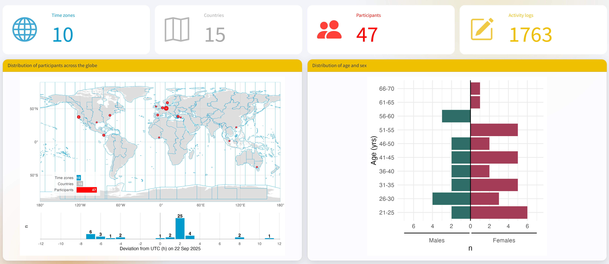

::: {custom-style="Manuscript Type"}
DATA NOTE
:::

::: {custom-style="Manuscript Title"}
A Day in Daylight 2025: wearable personal light exposure and contextual event-log data from a global equinox-day participatory event
:::

::: {custom-style="Authors"}
Johannes Zauner^1,*^, Resshaya Roobini Murukesu^3^, Manuel Spitschan^1,2,3^
:::

::: {custom-style="Affiliations"}
^1^ Technical University of Munich, Germany  
^2^ Max Planck Institute for Biological Cybernetics, Germany  
^3^ TUMCREATE Ltd., Singapore  
Johannes Zauner: johannes.zauner@tum.de; ORCID 0000-0003-2171-4566  
Resshaya Roobini Murukesu: resshaya.murukesu@tum-create.edu.sg; ORCID 0000-0002-0947-5817  
Manuel Spitschan: manuel.spitschan@tum.de; ORCID 0000-0002-8572-9268  
^*^ Corresponding author: Johannes Zauner, johannes.zauner@tum.de
:::

# Abstract

Personal light exposure varies with geography, daylight availability, built environments and behaviour, but reusable field datasets that combine wearable measurements with time-resolved context remain uncommon. *A Day in Daylight 2025* was a TUM and TUMCREATE-led participatory event for Daylight Awareness Week 2025 in which contributors around the world wore personal light loggers and recorded structured activity and lighting-context transitions around the September equinox. After cleaning and pre-processing, the curated dataset represents 47 contributors in 15 countries and 10 UTC offsets, with 1,763 linked activity-log entries. The release workflow harmonises light levels as floor-aligned one-minute means on a 50-hour UTC grid, producing 141,000 observations. ActLumus (n = 45) devices record photopic illuminance and melanopic equivalent daylight illuminance, whereas ActTrust devices (n = 2) provide photopic illuminance but not melanopic equivalent daylight illuminance. The curated release preserves these distinct measurements, recorded and corrected timestamps, gap status and a shared opaque identifier across four participant-linked tables. Direct identifiers, free text, device serials, city, raw flight numbers and device/app payloads are excluded. Exact age, sex assigned at birth, cleaned country and coordinates rounded to one decimal place are retained; three travel records use opaque dated-flight identifiers that preserve same-flight linkage.

**Keywords:** personal light exposure; wearable light logger; daylight; melanopic equivalent daylight illuminance; photopic illuminance; contextual event log; equinox; FAIR data

# Introduction

Light reaching the eye supports vision and also influences circadian, neuroendocrine, sleep and alerting responses. The CIE S 026 system distinguishes photopic quantities from alpha-opic quantities, including melanopic equivalent daylight illuminance (melanopic EDI); those quantities are not interchangeable [@cie2018]. Consensus recommendations for healthy adults are expressed in melanopic EDI because spectral composition matters in addition to photopic illuminance [@brown2022]. Describing real-world exposure therefore benefits from calibrated wearable measurements together with contextual information about wear state, activity, setting, daylight, electric light and screen use.

*A Day in Daylight 2025* formed part of Daylight Awareness Week 2025, held from 3 to 7 November under the theme “Future Solar Societies” [@daylightweek2025]. The Translational Sensory & Circadian Neuroscience Unit (MPS/TUM/TUMCREATE) organised the event, and an online panel on 3 November 2025 invited researchers, students and the wider public to explore how daylight exposure varied across daily life and geography [@adayindaylightwebsite2025; @tum2025adayindaylight]. Contributors recorded personal light exposure on and around the equinox on 22 September 2025 and annotated transitions in their activities and lighting contexts. The project was created as a participatory awareness event with a public [interactive dashboard](https://tscnlab.github.io/2025_ADayInDaylight/Dashboard.html) and an openly inspectable [underlying R/Quarto analysis](https://tscnlab.github.io/2025_ADayInDaylight/Analysis.html), not as a representative epidemiological study.

This Data Note documents the underlying data resources and their provenance without presenting inferential analyses or substantive conclusions. Its purposes are to reconcile the different data grains and headline counts, describe the wearable and event-log schemas, identify transformations that affect reuse, report validation findings, and document the privacy-preserving transformations applied to the release dataset.

# Methods

## Event design and contributors

The *A Day in Daylight 2025* event was a globally coordinated, equinox-day campaign involving collaborators and researchers who contributed wearable light measurements and contextual annotations. TUM and TUMCREATE led the event, with Technical University of Munich retaining institutional responsibility. Sites were invited to contribute at least one person, with additional contributors encouraged; there was no formal sampling frame, recruitment denominator or probability-based selection procedure. The dataset must therefore be understood as a purposive convenience contribution to a public-engagement event, not as a population-representative sample.

The REDCap export contains 52 distinct record identifiers. Fifty records include a device-information entry and correspond to 50 wearable export files. The implemented processing pipeline excludes three device records: one lacked a completed post-participation survey, one contained only data outside the target period, and one had insufficient coverage of the target window. Two additional survey records contributed activity logs but had no linked device-information record. The final dashboard comprises 47 included contributors.

## Wearable light measurements

The participant instructions specified an ActLumus or another calibrated light logger worn on the chest, attached by pin or lanyard, recording at 10-second intervals or the lowest available interval. No project-specific calibration or metrological traceability programme was required because the participatory event prioritised daylight awareness and practicability over high accuracy or cross-device measurement fidelity. Contributors were asked to wear the logger throughout their location-specific measurement period, record removals, and place the device on a nightstand facing upwards at night.

The source directory contains 50 Condor Instruments text exports: 47 ActLumus files (model AL0101) and three ActTrust1 files. The included set contains 45 ActLumus and two ActTrust streams. Across all exports, 46 streams have a 10-second dominant source epoch and four have a 60-second epoch; among the 47 included streams, the corresponding counts are 43 and four.

ActLumus exports contain a LIGHT channel representing photopic illuminance and a melanopic EDI channel. ActTrust exports contain LIGHT but no melanopic EDI channel.

## Contextual event logging

Structured survey and event data were collected with REDCap-compatible instruments [@harris2009; @harris2019]. Contributors were asked to enter a record on the MyCap smartphone app whenever their activity or setting changed, including whenever the logger was removed. Contributors recorded whether the logger was worn, not worn or placed for bedtime; social context; activity; broad and specific setting; daylight and electric-light conditions; screen use; and perceived autonomy over lighting. Repeated event entries also contained an optional free-text notes field. An intake questionnaire preceded personalised MyCap access, and a post-participation survey collected completeness ratings, behaviour-change feedback, location and time-zone information and, for some contributors, travel details.

The public release retains structured event categories required to interpret the wearable time series. It excludes open comments, behaviour-change narratives, logging-difficulty narratives, source participant and device identifiers, mobile-device/app payloads and serialised result paths. The participant metadata retain age, sex assigned at birth, cleaned country and latitude/longitude rounded to one decimal place while excluding city and exact coordinates. Age spans 22–70 years. Raw flight numbers are excluded. A domain-separated opaque `flight_id` allows contributors reporting the same dated flight to remain linkable without exposing the carrier or flight number.

## Import, time harmonisation and aggregation

Wearable files were imported with LightLogR [@zauner2025lightlogr] using the IANA time-zone identifier assigned to each contributor. Location strings and coordinates were normalised into city, country, IANA identifier and UTC offset in a separate preprocessing step. This was done using an OpenAI API prompt through the ellmer R interface (gpt-5-2025-08-07). The saved output was used in subsequent processing.

The legacy dashboard aggregated streams to five-minute intervals. For the reusable release, source re-import established that 43 included streams have a 10-second dominant epoch and four have a 60-second epoch. Five-minute aggregation was a dashboard convenience rather than a measurement requirement. The release therefore uses floor-aligned one-minute means: this preserves the four 60-second streams at their native grain and averages up to six observations for the 10-second streams. A complete one-minute grid is constructed from 2025-09-21 10:00:00 through, but not including, 2025-09-23 12:00:00 UTC. Rows without a contributing source observation are retained as explicit gaps with missing light values and are never replaced with zero. Recorded local, corrected local and corrected UTC timestamps remain distinct. The release used R 4.5.0, LightLogR 0.10.3 and tidyverse 2.0.0 [@wickham2019].

The three reported travel segments contain minute-resolution local start and end clock times plus separate IANA time-zone identifiers. The release builder interprets each clock time in its reported start or end zone, converts it to UTC and retains both local and UTC representations. All three resulting intervals are non-negative. Two contributors reported the same dated flight and therefore receive the same opaque `flight_id`; the third receives a different identifier.

## Event-state construction and linkage

Activity-log entries are ordered by contributor and timestamp, after which interval ends and durations are derived. This produces 1,763 non-negative event rows. The separate one-minute light table contains 141,000 unique participant–UTC timestamp keys. Structured categories are simplified into wear/non-wear detail, general and specific setting, daylight condition, electric-light condition and screen-use indicators. One opaque `participant_id` is shared by the light, event, participant-summary and travel tables; neither the serial nor the source crosswalk is written to the public files.

{#fig-flow width=100% fig-alt="Three rounded, icon-led panels show contributed records, linkage and quality control, and the linked public data package. Stage 1 contains 52 survey record identifiers, 50 logger exports and 1,827 activity-log entries. Stage 2 contains 47 included contributors, documents three excluded logger records, two survey records without a linked logger and 64 excluded or unlinked activity entries, and shows one-minute harmonisation of 43 ten-second and four sixty-second streams with 46 explicit gaps retained. Stage 3 contains 141,000 participant-minutes in light_1min.csv, 1,763 event intervals in events.csv, 47 participant rows in participant_metadata.csv and three travel intervals in travel_segments.csv, all joined through one opaque participant_id. A safeguard band states that direct identifiers, device serials, free text and raw flight numbers were removed while gaps and device-specific light semantics were retained."}

# Data description

## Source inventory and public release files

The repository audit identified four principal source and processed layers (Table 1). Raw wearable exports contain 2,086,295 sensor rows before aggregation. The public dataset contains four transformed, participant-linked tables with the documentation required to interpret and reuse them.

| Layer | Items/rows | Contributors or records | Public-release treatment |
|---|---:|---:|---|
| REDCap survey export | 1 file; 1,879 rows | 52 record IDs | Excluded; curated structured fields only |
| Wearable logger exports | 50 files; 2,086,295 rows | 50 device records | Excluded; parsed sensor fields only |
| **Linked event object** | **1,763 entries** | **47 contributors** | **Released under CC BY 4.0 as `events.csv`** |
| Five-minute dashboard object | 28,203 legacy rows; 28,200 unique sensor-time positions | 47 contributors | Exploratory visualisation and legacy validation only; not released as participant data |
| **One-minute release grid** | **141,000 expected rows; 140,954 observed and 46 explicit gaps** | **47 contributors** | **Released under CC BY 4.0 as `light_1min.csv`** |

Table 1. Audited data layers and public-release treatment.

`light_1min.csv` uses a unique `participant_id`–`timestamp_utc` key and includes recorded and corrected local timestamps, correction provenance, device family, source and aggregation epochs, contributing-observation count, mean photopic illuminance, mean melanopic EDI where available, explicit-gap status and validation flags. `events.csv` contains the same opaque `participant_id`, state start and end times, duration, structured wear/activity/setting variables, daylight and electric-light conditions, screen indicators and lighting autonomy. `participant_metadata.csv` contains the same identifier, device family, exact age, sex assigned at birth, cleaned country, one-decimal coordinates and aggregate completeness counts. `travel_segments.csv` contains three one-minute-resolution travel intervals, start/end IANA zones and a separate opaque `flight_id`. The complete variable-level dictionary, a sanitised structured questionnaire, a machine-readable instrument codebook and a deidentified summary of the protocol and participant instructions are included in the release package; they contain no participant responses or contributor contact details.

The 47 included contributors represent 15 countries, 17 IANA time-zone identifiers and 10 UTC offsets on 22 September 2025. The [interactive dashboard](https://tscnlab.github.io/2025_ADayInDaylight/Dashboard.html) supports descriptive exploration of individual profiles and aggregate patterns, and its [complete underlying R/Quarto analysis](https://tscnlab.github.io/2025_ADayInDaylight/Analysis.html) exposes the processing and plotting workflow. The release described here uses a semantics-preserving one-minute light grid, retains explicit gaps, preserves device-specific optical channels and keeps events in a separate table. The dashboard object and release tables are therefore related but intentionally not interchangeable.

Figure 2 reproduces the dashboard overview at aggregate display resolution. Its cards report 10 UTC offsets, 15 countries, 47 participants and 1,763 linked activity logs; the map combines participant-location markers with an offset-frequency strip, and the population pyramid shows age in five-year groups by sex. The dashboard view is descriptive and does not establish population representativeness.

{#fig-dashboard width=100% fig-alt="Dashboard overview with four headline cards reporting 10 time zones, 15 countries, 47 participants and 1,763 activity logs. A world map shows participant-location markers across multiple continents and a strip chart of participant counts by UTC offset. A mirrored horizontal bar chart shows participant counts in five-year age groups from 21–25 to 66–70, with males on the left and females on the right."}

# Data validation

The 50-hour release window contains 3,000 one-minute bins per contributor. Forty-seven contributors, therefore, yield 141,000 unique participant-time positions. Source observations contribute to 140,954 rows; the remaining 46 rows are explicit gaps with missing measurements.

Among 27,003 processed ActLumus rows, eight melanopic EDI values are missing. The two ActTrust streams contribute 1,200 rows. No negative values were detected in either processed light field. These checks validate inventory and range, not manufacturer calibration performance, cross-device equivalence or biological interpretation.

| Validation check | Observed | Release implication |
|---|---|---|
| Included contributors, countries and UTC offsets | 47; 15; 10 | Matches hosted dashboard |
| Raw and linked event entries | 1,827; 1,763 | Document 64 excluded/unlinked entries |
| Unique one-minute participant–UTC keys | 141,000 | Expected 47 × 3,000 positions |
| Native epoch composition | 43 ten-second; 4 sixty-second streams | Harmonise as floor-aligned one-minute means |
| Explicit one-minute gaps | 46 | Retain missing measurements; never substitute zero |
| Legacy duplicate participant–UTC keys | 3; 0 after chronological repair | Sort events before deriving state intervals |
| ActLumus melanopic EDI missingness | 8 of 27,003 rows | Preserve as explicit missing values |
| ActTrust channel semantics | 1,200 rows; 0 value mismatches after repair | Restore photopic LIGHT; do not infer melanopic EDI |
| Negative processed light values | 0 | No negative-value remediation needed |
| Malaysian timestamp correction | 1 stream; 3,000 one-minute rows; −115,200 seconds | Retain recorded and corrected times; flag the author-approved correction |
| Participant-data sharing basis | implicit event-level agreement accepted by TUM for the transformed CC BY 4.0 release | The formal institutional waiver is reported in the Ethics and consent section |
| Location and travel transform | 38 one-decimal coordinate cells, including 33 singletons; 3 travel rows in 2 opaque dated-flight groups | City and raw flight numbers absent |
| Exact age and sex at birth | Ages 22–70; 30 distinct ages; 22 singleton exact-age participants; 45 of 47 combined demographic-location profiles unique | Exact fields retained; release described as pseudonymised |
| Exact participant archive | 19 privacy, schema, linkage, timestamp and measurement checks; 0 failures; 2 warnings | Approved by all authors for publication |

Table 2. Principal validation findings. Warnings record accepted residual linkage risk rather than direct-identifier or schema failures.

# Limitations

The event used a purposive convenience sample drawn from an international professional and collaborator network. It is geographically broad but not representative of the participating countries, demographic groups or general population. Observation centred on one equinox day, so the data do not characterise seasonal or within-person variability.

In a few cases, another logger family and sampling interval were used. The two logger families do not provide the same optical channels; in particular, ActTrust photopic illuminance cannot substitute for melanopic EDI. The devices were manufacturer calibrated, but no project-specific calibration, traceability assessment or cross-device comparison was required for this awareness-focused event. The values should therefore not be interpreted as metrologically interchangeable or as a high-fidelity comparison between logger families.

Contextual states are self-reported and depend on contributors logging transitions. Some entries may have been delayed, omitted or recorded retrospectively. Exact state durations are derived from the following chronologically ordered entry, and the terminal-state rule requires explicit documentation.

Finally, wearable time series, timestamps and event sequences can be identifying even after names are removed. Deidentification therefore requires more than deleting direct identifiers. The release excludes free text, source identifiers, city, exact coordinates and raw flight numbers, but retains exact age and sex assigned at birth. Coordinates rounded to one decimal place still form singleton cells for 33 of 47 contributors; 22 contributors have a singleton exact age; the complete country-coordinate-age-sex profile is unique for 45 of 47 contributors; all 47 exact event-sequence signatures are distinct; and the three exact travel intervals remain highly distinguishing. The resulting files are therefore pseudonymised rather than anonymous. Exact-file review found no blocking direct-identifier, schema, linkage, measurement or timestamp failure and retained these risks as two explicit warnings.

# Ethics and consent

The activity was organised under the responsibility of Technical University of Munich as a participatory public-outreach event for Daylight Awareness Week, rather than as a traditional human-participant research study [@zauner2026auxiliary]. The information provided to contributors described the event aim, wearable measurement, contextual logging, questionnaires, contact route and timeline.

The invited contributors were researchers from around the world, and the event was framed around open and reproducible data analysis and sharing; participation was therefore understood as implicit agreement to that purpose. No formal withdrawal procedure or deadline was specified, but contributors could withdraw their data at any time without repercussions. [The formal institutional waiver was issued by **[responsible body]** on **[decision date]** under reference **[reference number]**. The approved determination states: **[exact approved wording]**.]{.mark}

# Data availability

The analysis code, public dashboard and original project archive are available through the GitHub repository and Zenodo software record [@murukesu2025]. The Zenodo concept DOI is 10.5281/zenodo.17464829. That record is a software archive and is distinct from the dedicated dataset deposit for this Data Note.

The curated dataset is publicly available from the GitHub dataset release at **[[DATASET RELEASE URL]]{.mark}** and from Zenodo under the dedicated [**Dataset DOI [DATASET DOI]**]{.mark}, under CC BY 4.0. The deposited archive contains the four participant tables, a public README, data dictionary, licence and citation metadata, provenance and correction records, sanitised instrument documentation, focused validation and privacy summaries, checksums, and the R/Quarto data showcase. Internal publication gates, build instructions, deposit-form metadata, machine logs, caches, raw logger exports, confidential source documents and identifier crosswalks are not part of the Zenodo archive. The dataset comprises 141,000 light rows, 1,763 event rows, 47 participant-summary rows and three travel rows.

# Software availability

The reproducible project source is hosted in the [GitHub repository](https://github.com/tscnlab/2025_ADayInDaylight), with an [interactive public dashboard](https://tscnlab.github.io/2025_ADayInDaylight/Dashboard.html), its [complete underlying R/Quarto analysis](https://tscnlab.github.io/2025_ADayInDaylight/Analysis.html), and archived source at <https://doi.org/10.5281/zenodo.17464829>. The dashboard and analysis document the legacy five-minute exploratory workflow; the release audit and semantics-preserving one-minute processing use LightLogR 0.10.3 [@zauner2025lightlogr]. The public dataset archive includes an R/Quarto showcase used to demonstrate linkage and descriptive reuse.

# Author contributions

J.Z.: Data curation, Methodology, Software, Validation, Visualization, Writing – original draft, Writing – review & editing. R.R.M.: Conceptualization, Investigation, Project administration, Resources, Writing – review & editing. M.S.: Conceptualization, Funding acquisition, Project administration, Supervision, Writing – review & editing.

# Funding

This work received no specific grant from any funding agency in the public, commercial or not-for-profit sectors. The event was organised by the Translational Sensory & Circadian Neuroscience Unit (MPS/TUM/TUMCREATE) as part of Daylight Awareness Week 2025, initiated by the Daylight Academy.

# Competing interests

M.S. declares the following potential conflicts of interest in the past five years (2021–2026): academic roles as Member of the Board of Directors of the Society of Light, Rhythms, and Circadian Health (SLRCH), Chair of Joint Technical Committee 20 (JTC20) of the International Commission on Illumination (CIE), Member of the Daylight Academy, and Chair of the Research Data Alliance Working Group Optical Radiation and Visual Experience Data; remunerated roles as Speaker of the Steering Committee of the Daylight Academy, ad hoc reviewer for the Health and Digital Executive Agency of the European Commission, ad hoc reviewer for the Swedish Research Council, Associate Editor for LEUKOS, examiner for the University of Manchester, Flinders University, and the University of Southern Norway, and consultant for LyS Technologies and RoX Health; research funding and support from the Max Planck Society, Max Planck Foundation, Max Planck Innovation, Technical University of Munich, Wellcome Trust, National Research Foundation Singapore, European Partnership on Metrology, VELUX Foundation, Bayerisch-Tschechische Hochschulagentur (BTHA), BayFrance/Bayerisch-Französisches Hochschulzentrum, BayFOR/Bayerische Forschungsallianz, and Reality Labs Research; honoraria for talks from ISGlobal, the Research Foundation of the City University of New York, and the Stadt Ebersberg, Museum Wald und Umwelt; travel reimbursements from the Daimler und Benz Stiftung; and being named on European Patent Application EP23159999.4A, “System and method for corneal-plane physiologically-relevant light logging with an application to personalized light interventions related to health and well-being.” M.S. declares that the disclosed roles and relationships had no influence on the work presented herein. The funders had no role in study design, data collection and analysis, the decision to publish, or preparation of the manuscript.

J.Z. declares the following potential conflicts of interest in the past five years (2021–2026): academic roles as Member of Joint Technical Committee 20 (JTC20) of the International Commission on Illumination (CIE), Member of the Research Data Alliance Working Group Optical Radiation and Visual Experience Data, and Speaker of group 2, melanopic effects of light, of the Technical Scientific Committee (TWA) of the German Society of Lighting Technology and Design (LiTG); remunerated roles as examiner for the Swiss Lighting Society; teacher for LiTG, the University of Applied Sciences Munich, and the Technical University of Applied Sciences Rosenheim; associated partner at 3lpi lighting design + engineering, Munich; tool and 3D-model designer for Zumtobel Lighting GmbH; and course designer for the University of Applied Sciences Munich and Virtual University Bavaria; honoraria for talks from LiTG, Lamilux/Heinrich Strunz GmbH, Robert-Bosch Hospital Stuttgart, Ergotopia GmbH, the German statutory accident insurance institution for the administrative sector (VBG), BRIXEN CULTUR, KITEO GmbH & Co. KG, and the University of Applied Sciences Augsburg; travel reimbursements from the Daimler und Benz Stiftung; and, together with 3lpi, holding a design patent for a non-visually optimized luminaire, No. 008194021–0001 through -0006, at the European Union Intellectual Property Office.

R.R.M. declares no potential conflicts of interest.

# Acknowledgements

The authors thank all contributors who wore light loggers and recorded contextual events, the Daylight Academy and Daylight Awareness Week organisers, and the collaborators who supported device distribution, data collection and the public event.

# Artificial-intelligence disclosure

The original repository records the use of an OpenAI API workflow to normalise manually entered locations (gpt-5-2025-08-07), and its saved output was used in processing. OpenAI Codex was used to assist with repository auditing, drafting, code generation, figure preparation and document quality assurance for this Data Note package. The authors retain responsibility for the content, correction of errors and protection of confidential information and have verified and approved the manuscript and data release.

# References
